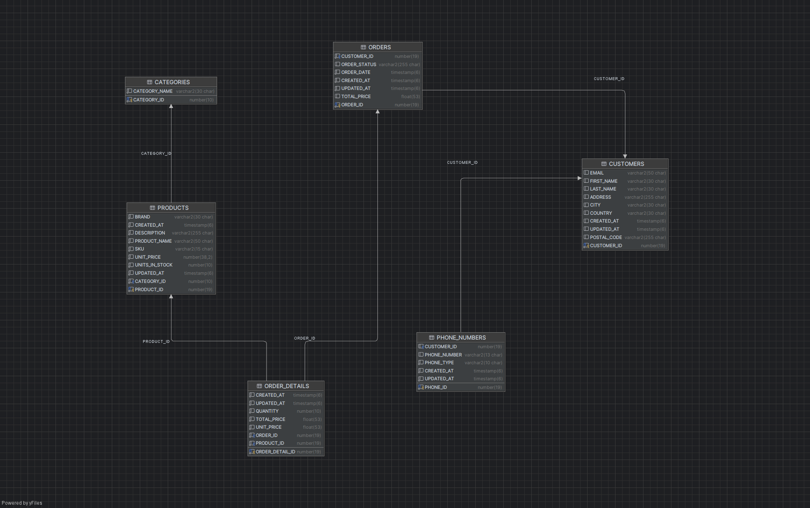

# 🛒 E-Commerce API with Spring Boot & Oracle

Bu proje, Spring Boot ve Oracle Database kullanılarak geliştirilen katmanlı mimariye sahip bir e-ticaret sistemidir. Projede ürünler, kategoriler, müşteriler, siparişler ve sipariş detayları gibi temel kavramlar yer almakta; ayrıca müşterilerin birden fazla telefon numarasına sahip olabildiği bir yapı da desteklenmektedir.

---

## 🧰 Kullanılan Teknolojiler

- Java 17
- Spring Boot
- Spring Data JPA
- Oracle 19c Database
- Lombok
- Maven
- Postman (testler için)

---

## 🧠 Proje Mimarisi

Proje, klasik Spring Boot mimarisiyle inşa edilmiştir:

- `Controller` – API endpoint'leri
- `Service` – İş kuralları ve iş mantığı
- `Repository` – Veritabanı işlemleri (JPA)
- `DTO` – Veri transfer nesneleri
- `Entity` – Veritabanı tabloları ile birebir eşleşen Java sınıfları
- `Converter` – Entity/DTO dönüşümleri
- `Exception Handling` – Global hata yönetimi

---

## 🧩 ER Diyagramı

Aşağıdaki diyagram, projedeki tüm tablo ve ilişkileri göstermektedir:

---

## 🗃️ Veri Tabanı Tabloları ve İlişkiler

### 🧑‍🤝‍🧑 `CUSTOMERS`
- Temel müşteri bilgilerini içerir.
- `CUSTOMER_ID` primary key.
- `PHONE_NUMBERS` ve `ORDERS` ile bire çok ilişki.

### ☎️ `PHONE_NUMBERS`
- Bir müşterinin birden fazla telefon numarasını tutar.
- `CUSTOMER_ID` foreign key.
- `PHONE_TYPE` ile ev, iş gibi tür ayrımı yapılabilir.

### 🛍️ `ORDERS`
- Sipariş başlık bilgilerini tutar.
- `CUSTOMER_ID` foreign key.
- `ORDER_DETAILS` ile bire çok ilişkili.

### 📦 `ORDER_DETAILS`
- Siparişin ürün bazlı detaylarını tutar.
- Hem `ORDER_ID` hem de `PRODUCT_ID` foreign key.
- `TOTAL_PRICE` burada hesaplanır.

### 📚 `PRODUCTS`
- Ürün bilgileri.
- `CATEGORY_ID` ile `CATEGORIES` tablosuna bağlı.

### 🗂️ `CATEGORIES`
- Ürünlerin ait olduğu kategoriler.
- `CATEGORY_ID` primary key.

---

## 🔄 Tablolar Arası İlişkiler

- `CUSTOMERS (1) ↔ (N) PHONE_NUMBERS`
- `CUSTOMERS (1) ↔ (N) ORDERS`
- `ORDERS (1) ↔ (N) ORDER_DETAILS`
- `PRODUCTS (1) ↔ (N) ORDER_DETAILS`
- `CATEGORIES (1) ↔ (N) PRODUCTS`

---

## 🧪 API Örnek Endpointler

| HTTP | Endpoint | Açıklama |
|------|----------|----------|
| `GET` | `/api/products` | Tüm ürünleri getir |
| `POST` | `/api/products` | Yeni ürün oluştur |
| `GET` | `/api/customers/{id}` | Belirli müşteriyi getir |
| `GET` | `/api/customers/{id}/phone-numbers` | Müşterinin telefon numaralarını getir |
| `POST` | `/api/orders` | Yeni sipariş oluştur |
| `GET` | `/api/orders/{id}` | Sipariş detaylarını getir |

---

## 📤 DTO Yapıları

Proje veri alışverişinde DTO yapıları kullanır:

- `ProductRequest`, `ProductResponse`
- `CustomerRequest`, `CustomerResponse`
- `PhoneNumberRequest`, `PhoneNumberResponse`
- `OrderRequest`, `OrderResponse`
- `OrderDetailResponse`
- `CustomerPhoneNumberResponse`

---

## 🔄 Converter Katmanı

DTO ↔ Entity dönüşümleri özel sınıflarla yapılır. Bu katman, controller-servis-entity arasında veri formatını doğru biçimde yönetir.

---

## ❗ Hata Yönetimi

Global exception handler (@ControllerAdvice) ile:
- Hatalar anlamlı mesajlarla dönülür.
- HTTP durum kodları standartlaştırılmıştır (400, 404, 500, vs).

---

## 📌 Geliştirici Notları

- Tüm timestamp alanlarında `@CreationTimestamp`, `@UpdateTimestamp` anotasyonları kullanıldı.
- Entity’ler `BaseEntity` sınıfından kalıtımla ortak alanları paylaşır.
- Oracle DB’de `NUMBER`, `VARCHAR`, `TIMESTAMP` gibi veri türleri kullanıldı.
- `@ManyToOne`, `@OneToMany`, `mappedBy` anotasyonlarıyla ilişkiler tanımlandı.

---

## 🙋‍♂️ Geliştirici

**Yaşar Can Sandallı**  
📍 Atatürk Üniversitesi – Bilişim Sistemleri ve Teknolojileri  
🔗 [GitHub Profilim](https://github.com/Yasar-Can-Sandalli)

---

> README, geliştirmenin ilerleyişine göre güncellenebilir.
